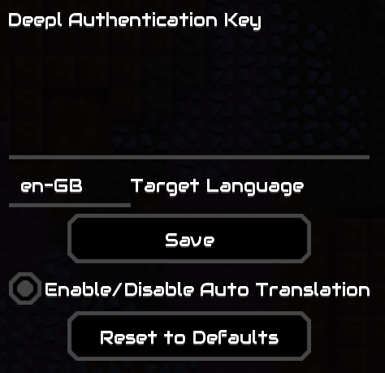

# Auto Translate

Automatically translates chat messages in Mindustry multiplayer.

Requires you to register an account at [Deepl](https://www.deepl.com/de/pro-checkout/account?productId=1200&yearly=false&trial=false). \
You will need to enter a credit card for verification, no money is being charge for the Deepl Api Free. 
The API includes 500.000 characters/month, which are approximately 10.000 messages/month, which should be more than enough
for a single user.

Further, you need to change the modules file of your Mindustry jre to a modules file including the modules 
`jdk.crypto.ec jdk.crypto.cryptoki`. Otherwise, the mod is not able to establish a connection to Deepl.
A modules file containing those two modules is available for download in the Releases.

After registration copy your API Key found in your account settings and enter it into the settings of the mod.

Besides entering your API Key you can also change the language you want the messages to get translated to
and disable/enable the mod while playing.

